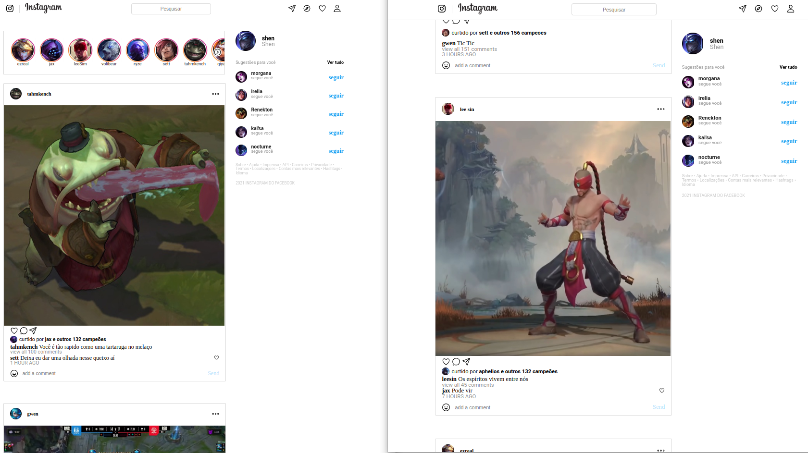

# Instagram

<p align="center">
   
</p>


- Este projeto é uma cópia do layout da rede do instagram realizado na segunda semana de formação da DRIVEN
- Nada melhor que começar na programação por HTML e CSS
 
- [Veja meu deploy na github pages aqui](https://marcojr73.github.io/projeto2-instagram/)

***

# Demonstração

<div align=center>
   
</div>


## Como usar

Instale meu projeto e abra-o no navegador

```bash
  git clone git@github.com:marcojr73/projeto2-instagram.git
```

***

##	 Tecnologias e Conceitos

- HTML
- CSS
- Display responsivo para mobile, tablet e PCs
***
    
